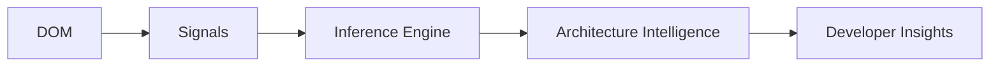
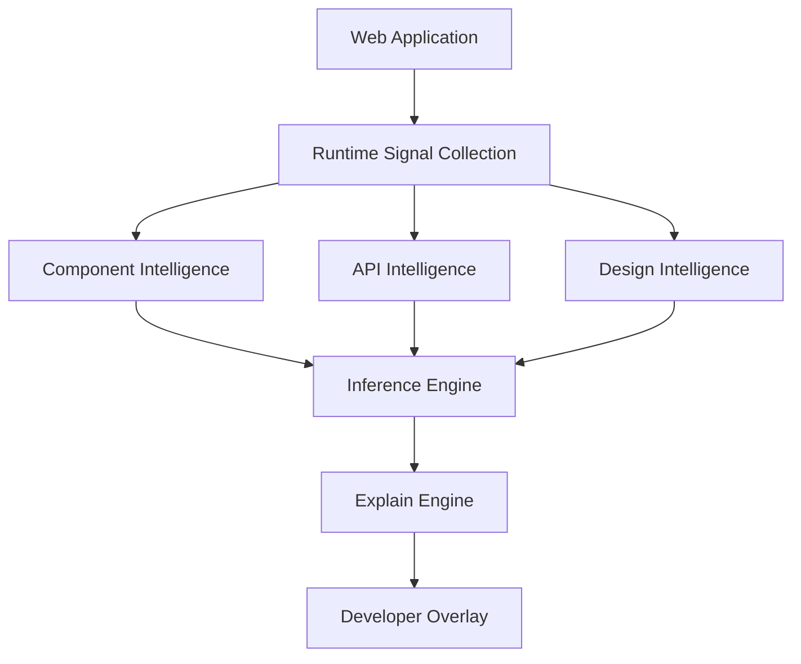
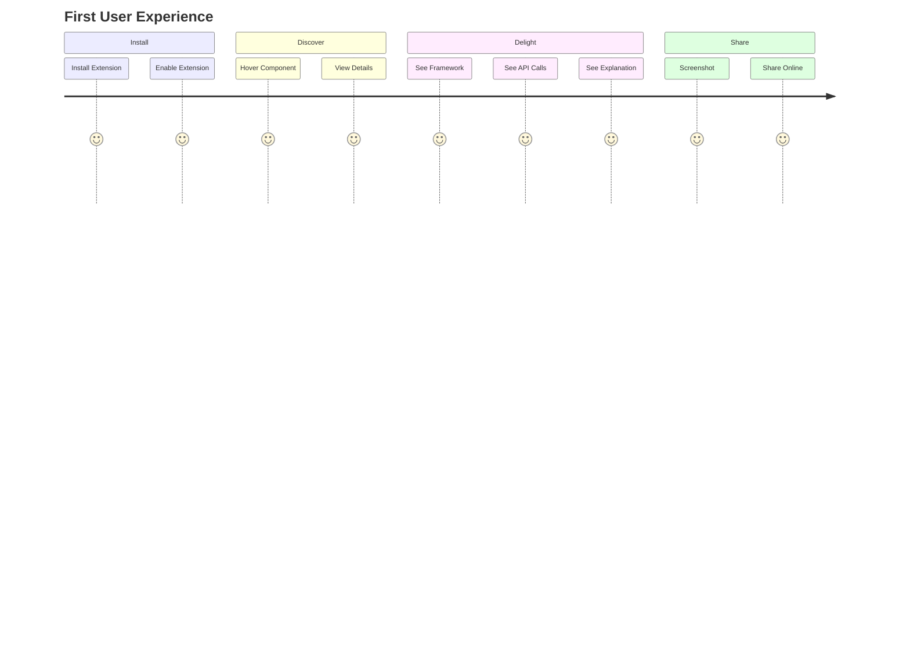
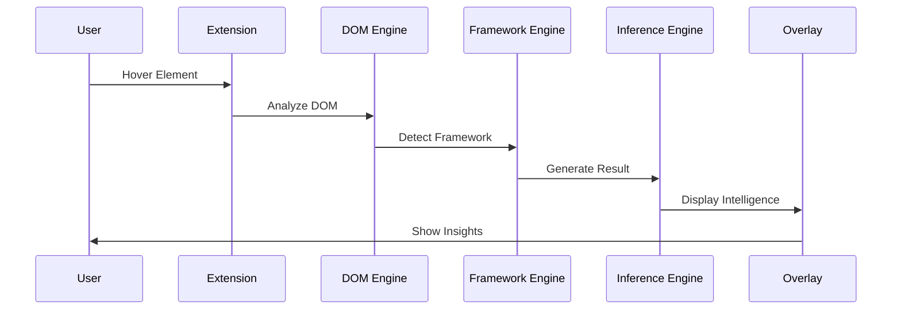
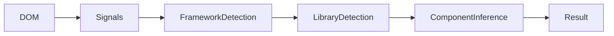
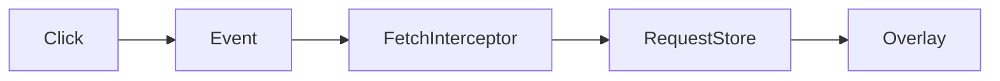

# Archify FOUNDER OPERATING DOCUMENT

## Part 2 — Product Requirements, UX Architecture, MVP Definition & Functional Specifications

---

# 16. Product Overview

## Product Definition

Archify is a browser-native Architecture Intelligence Platform that helps developers understand how web applications work.

It observes:



Instead of exposing raw browser information, Archify transforms runtime signals into developer understanding.

---

# 17. Product Objectives

## Primary Objective

Reduce software comprehension time by 90%.

Example:

Current:

```text
Understand Login Flow

45 minutes
```

Archify:

```text
Understand Login Flow

30 seconds
```

---

## Secondary Objectives

### Faster Onboarding

Reduce onboarding time.

### Faster Debugging

Reduce issue discovery time.

### Faster Reverse Engineering

Reduce architecture discovery effort.

### Better Documentation

Generate architecture understanding automatically.

---

# 18. MVP Definition

One of the biggest startup mistakes is building too much.

Archify V1 should NOT include:

❌ SaaS Dashboard

❌ Team Collaboration

❌ Cloud Storage

❌ Jira Integration

❌ Analytics

❌ Browser Sync

❌ Enterprise Features

❌ User Accounts

❌ Architecture Graphs

❌ Monetization

---

# Actual MVP

Only three capabilities matter.

## Capability 1

### Component Intelligence

Example:

```text
Element:
Button

Likely Component:
<Button />

Framework:
Next.js

Library:
shadcn/ui

Confidence:
91%
```

---

## Capability 2

### API Intelligence

Example:

```text
Triggered APIs

POST /api/login

Response Time:
342ms

Status:
200
```

---

## Capability 3

### Explain Mode

Example:

```text
This appears to be a login form.

Contains:
- Email field
- Password field
- Submit button

Purpose:
Authenticate users.
```

---

If developers love these three things,

continue building.

If not,

stop.

---

# 19. Product Architecture

## Product Layers



---

# 20. User Journey

## First Time User



The first 60 seconds determine retention.

---

# 21. Core User Flow

## Component Discovery Flow



Expected latency:

<200ms

---

# 22. Information Architecture

## Overlay Structure

```text
┌──────────────────────┐

Component Intelligence

Button

Framework:
Next.js

Library:
shadcn/ui

Confidence:
91%

------------------

API Intelligence

POST /api/login

342ms

------------------

Explain

Authentication Entry Point

└──────────────────────┘
```

---

# 23. UX Principles

## Principle 1

Never cover content.

Overlay must intelligently reposition.

---

## Principle 2

Information density matters.

Developers hate unnecessary whitespace.

---

## Principle 3

Everything should be copyable.

Examples:

```text
Copy Component

Copy API

Copy Analysis
```

---

## Principle 4

Keyboard-first workflow.

Developers love shortcuts.

---

# 24. Interaction Model

## Hover Mode

Default interaction.

User hovers.

Insights appear.

---

## Locked Mode

User clicks.

Overlay stays visible.

Useful during debugging.

---

## Deep Inspect Mode

User presses:

```text
Alt + Click
```

Additional details appear.

---

# 25. Functional Requirements

---

## FR-001

### Element Selection

Description:

User can select any visible DOM element.

Acceptance Criteria:

* Hover detection works
* Click locking works
* Nested elements handled

Priority:

P0

---

## FR-002

### Framework Detection

Description:

Detect framework.

Supported:

* React
* Next.js
* Vue
* Angular

Acceptance Criteria:

Framework shown correctly.

Priority:

P0

---

## FR-003

### Component Detection

Description:

Infer likely component.

Acceptance Criteria:

Confidence score provided.

Priority:

P0

---

## FR-004

### API Detection

Description:

Capture API requests triggered by interactions.

Acceptance Criteria:

Method shown.

URL shown.

Status shown.

Priority:

P0

---

## FR-005

### Explain Mode

Description:

Generate human explanation.

Acceptance Criteria:

Explanation appears within 3 seconds.

Priority:

P0

---

# 26. Non Functional Requirements

## Performance

Overlay render:

<100ms

---

Analysis:

<200ms

---

Explain Mode:

<3 seconds

---

Memory:

<50MB

---

CPU:

<5%

---

# 27. User Stories

## Frontend Engineer

As a frontend engineer

I want to identify components quickly

So I can debug faster.

---

## QA Engineer

As a QA engineer

I want API visibility

So I can create better bug reports.

---

## Technical Founder

As a founder

I want architecture visibility

So I can understand products.

---

# 28. MVP Scope Matrix

| Feature             | MVP |
| ------------------- | --- |
| Component Detection | Yes |
| Framework Detection | Yes |
| API Detection       | Yes |
| Explain Mode        | Yes |
| Architecture Graph  | No  |
| Team Features       | No  |
| SaaS                | No  |
| Collaboration       | No  |
| Authentication      | No  |
| Cloud Storage       | No  |

---

# 29. Feature Prioritization Framework

## P0

Must Exist

* Component Intelligence
* API Intelligence
* Explain Mode
* Overlay

---

## P1

Should Exist

* Accessibility Hints
* Design Tokens
* Export Report

---

## P2

Nice To Have

* Architecture Graph
* Team Sharing
* Cloud Sync

---

# 30. Component Intelligence Engine

## Mission

Determine:

```text
What is this thing?
```

Input:

DOM Element

Output:

```json
{
  "component":"Button",
  "framework":"Next.js",
  "library":"shadcn/ui",
  "confidence":91
}
```

---

## Signals

Collected:

* Tag
* Class Names
* Attributes
* DOM Structure
* Framework Hooks
* CSS Patterns

---

## Inference Pipeline



---

# 31. API Intelligence Engine

## Mission

Determine:

```text
What backend system is involved?
```

---

## Captured Data

```json
{
  "method":"POST",
  "url":"/api/login",
  "status":200,
  "latency":342
}
```

---

## Pipeline



---

# 32. Explain Engine

## Mission

Translate technical complexity into human understanding.

Input:

Runtime Signals

Output:

Explanation

---

Example

Input:

```text
Button
POST /api/login
JWT Storage
Redirect
```

Output:

```text
This button initiates user authentication.
```

---

# 33. Confidence System

Trust matters.

Every result requires confidence.

---

## Example

```text
Framework:
React

Confidence:
99%
```

---

```text
Component:
Dialog

Confidence:
62%
```

---

Low confidence must never be hidden.

---

# 34. Error Handling

## Unknown Framework

Show:

```text
Framework Unknown

Confidence:
0%
```

---

## Unknown Component

Show:

```text
Generic HTML Element
```

---

Never hallucinate.

---

# 35. Accessibility Requirements

Overlay must support:

* Keyboard Navigation
* Screen Readers
* High Contrast Mode

---

# 36. Success Criteria

Launch Success:

```text
1000 installs
```

---

Product Validation:

```text
30% weekly retention
```

---

Strong Signal:

```text
Developers share screenshots voluntarily.
```

---

# 37. MVP Kill Criteria

Kill project if:

After 90 days

```text
<1000 installs
```

AND

```text
<20% retention
```

Meaning:

Problem not painful enough.

---

# 38. Product Philosophy

Archify should never become:

```text
Another DevTools Panel
```

Every feature must answer:

```text
Does this improve understanding?
```

If not,

do not build it.

---

# End of Part 2

**Next Part:**
Technical Architecture, Chrome Manifest V3 Design, Detection Engines, Runtime Intelligence Engine, AI Architecture, Security Model, Privacy Model, Database Schemas, and Engineering RFCs.
