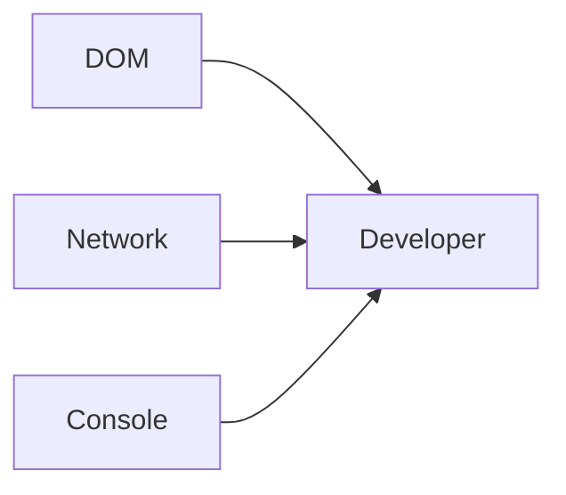
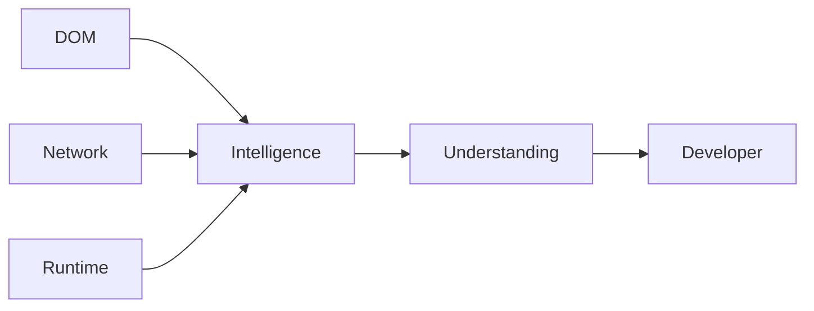
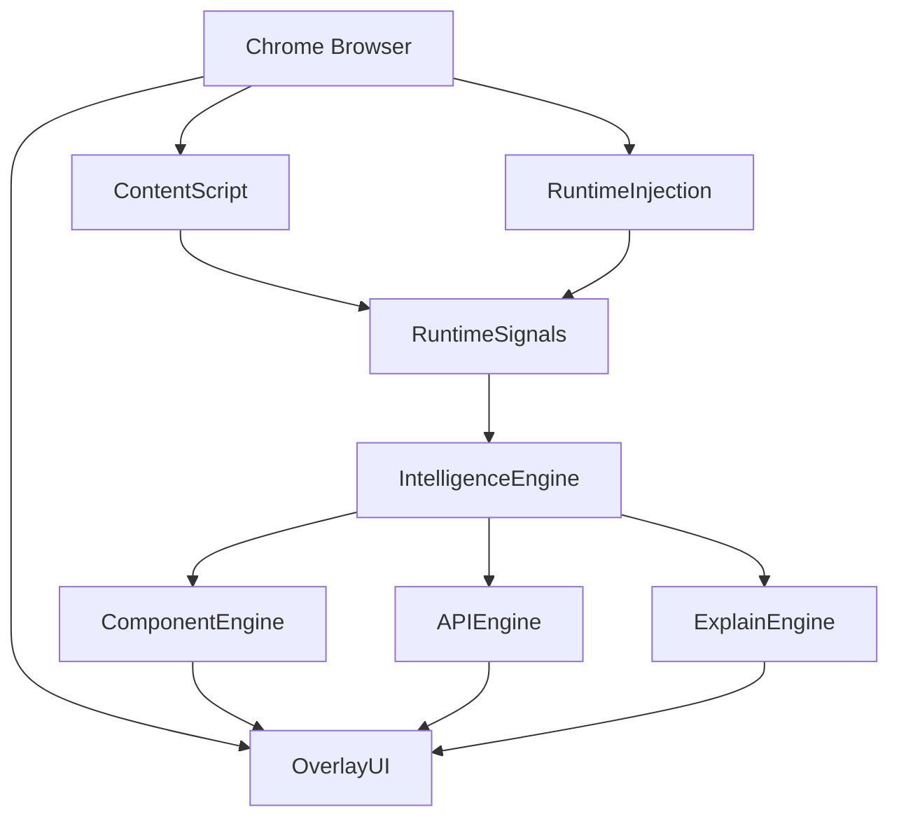
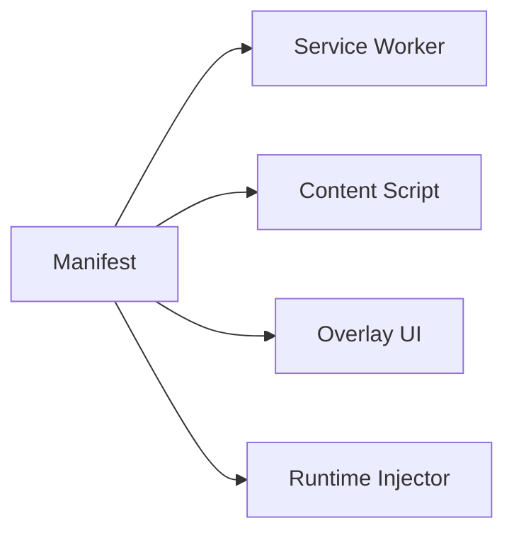
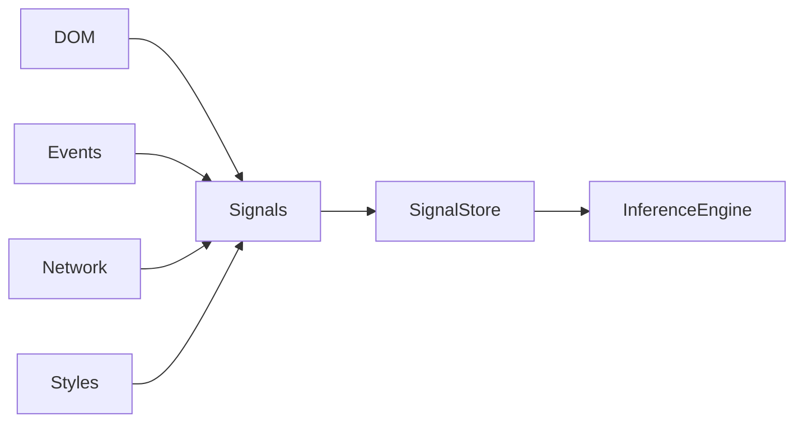
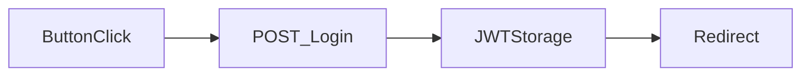

# Archify FOUNDER OPERATING DOCUMENT

## Part 3 — Technical Architecture, Runtime Intelligence Engine, Manifest V3 Design, AI Systems & Engineering RFCs

---

# 39. Technical Vision

Most developer tools expose raw information.

Archify exposes interpreted information.

This distinction fundamentally changes the architecture.

Traditional tools:



Archify:



Archify is fundamentally an inference system.

Not an inspection system.

---

# 40. System Architecture

## High Level Architecture



---

# 41. Architectural Principles

## Principle 1

Local First

All intelligence should happen locally whenever possible.

---

## Principle 2

Inference Before AI

Use deterministic systems first.

AI only fills gaps.

---

## Principle 3

Runtime Intelligence

Understand software through behavior.

Not source code.

---

## Principle 4

Trust Through Transparency

Every insight must explain:

* Why
* Confidence
* Evidence

---

# 42. Chrome Extension Architecture

## Components



---

## Responsibilities

### Service Worker

Responsible For:

* Configuration
* Preferences
* AI Requests
* Updates
* Analytics

Not Responsible For:

* Runtime Analysis
* DOM Processing

---

### Content Script

Responsible For:

* DOM Analysis
* Overlay Rendering
* Event Collection
* Signal Processing

---

### Runtime Injection Layer

Responsible For:

* Fetch Interception
* XHR Interception
* Event Tracing
* Runtime Observation

---

# 43. Manifest V3 Strategy

## Why MV3 Matters

Manifest V3 is restrictive.

Many extension ideas fail here.

Archify must be designed around MV3 limitations.

---

## Required Permissions

```json
{
  "permissions": [
    "storage",
    "scripting",
    "activeTab",
    "contextMenus"
  ]
}
```

---

## Host Permissions

```json
{
  "host_permissions": [
    "<all_urls>"
  ]
}
```

Reason:

Architecture intelligence requires visibility.

---

# 44. Runtime Intelligence Engine

The Runtime Intelligence Engine is the heart of Archify.

Everything else is a UI layer.

---

## Mission

Convert runtime signals into understanding.

Input:

```text
DOM
Events
Requests
Styles
Framework Metadata
```

Output:

```text
Component
Purpose
Behavior
Architecture
```

---

# 45. Runtime Signal Collection

## Signal Types

### DOM Signals

Collected:

```text
Tag Name
Classes
Attributes
Hierarchy
Position
```

---

### Runtime Signals

Collected:

```text
Event Listeners
Click Handlers
Input Handlers
Observers
```

---

### Network Signals

Collected:

```text
XHR
Fetch
GraphQL
WebSocket
```

---

### Style Signals

Collected:

```text
Colors
Typography
Spacing
Tokens
```

---

### Framework Signals

Collected:

```text
React Fiber
Vue Metadata
Angular Metadata
```

---

# 46. Runtime Signal Pipeline



---

# 47. Component Intelligence Engine

## Mission

Answer:

```text
What is this UI element?
```

---

# Input

```json
{
  "tag":"button",
  "class":"btn-primary",
  "framework":"react"
}
```

---

# Output

```json
{
  "component":"Button",
  "library":"shadcn/ui",
  "confidence":91
}
```

---

# 48. Component Detection Strategy

Detection occurs in layers.

---

## Layer 1

Framework Detection

Detect:

```text
React
Vue
Angular
Svelte
Solid
Next.js
Nuxt
```

---

## Layer 2

Library Detection

Detect:

```text
shadcn/ui
Material UI
Ant Design
Chakra
Mantine
Bootstrap
```

---

## Layer 3

Component Classification

Classify:

```text
Button
Dialog
Card
Dropdown
Navigation
Table
Modal
```

---

# 49. Confidence System RFC

Every inference returns confidence.

---

## Example

```json
{
  "component":"Dialog",
  "confidence":64
}
```

---

### Confidence Bands

90-100

```text
Very High
```

---

75-89

```text
High
```

---

50-74

```text
Medium
```

---

0-49

```text
Low
```

---

Never hide confidence.

---

# 50. Component Fingerprinting System

Future moat.

---

## Concept

Each UI library leaves fingerprints.

Example:

shadcn/ui Button:

```text
rounded-md
inline-flex
focus-visible
```

These patterns become signatures.

---

## Fingerprint Database

```json
{
  "library":"shadcn/ui",
  "component":"Button",
  "patterns":[]
}
```

---

Over time:

Thousands of signatures.

---

# 51. API Intelligence Engine

## Mission

Answer:

```text
What backend behavior exists?
```

---

# Runtime Hook Strategy

Inject:

```javascript
fetch()
XMLHttpRequest()
WebSocket()
```

wrappers.

---

# Captured Fields

```json
{
  "method":"POST",
  "url":"/api/login",
  "status":200,
  "duration":324
}
```

---

# 52. Request Correlation Engine

Most tools stop at request capture.

Archify continues.

---

Goal:

Determine:

```text
Which UI action caused this request?
```

---

Example



This is where architecture intelligence begins.

---

# 53. Explain Engine

Mission:

Convert technical data into human understanding.

---

Input:

```json
{
  "component":"Button",
  "api":"POST /login",
  "storage":"JWT"
}
```

---

Output:

```text
This button initiates user authentication.
```

---

# Explain Pipeline

```mermaid
flowchart LR

Signals

-->

Inference

-->

Context Builder

-->

Explanation

-->
User
```

---

# 54. AI Strategy

Critical Principle:

AI is not the product.

AI enhances the product.

---

Bad Product

```text
Ask AI what this button does.
```

---

Good Product

```text
We already know 80%.

AI explains remaining 20%.
```

---

# AI Responsibilities

Allowed:

* Summaries
* Explanations
* Naming

---

Not Allowed:

* Core Detection
* Framework Detection
* Runtime Mapping

---

# 55. Explain Context Builder

Before AI receives data:

Build context.

---

Example

```json
{
  "component":"Button",
  "framework":"React",
  "api":"POST /login",
  "page":"Authentication"
}
```

---

AI receives structured context.

Not raw DOM.

---

# 56. Privacy Architecture

Trust is a feature.

---

Default Mode

```text
100% Local
```

---

AI Mode

```text
Opt In
```

---

User Controls

```text
Disable AI

Disable Analytics

Disable Telemetry
```

---

# 57. Security Architecture

## Rule 1

No credential collection.

---

## Rule 2

Never store page contents.

---

## Rule 3

Never transmit DOM by default.

---

## Rule 4

No user tracking.

---

# 58. Event Store

Temporary runtime database.

---

Purpose:

Store:

```text
Events
Requests
Detections
Signals
```

---

TTL:

```text
Current Tab Session
```

---

Destroyed on navigation.

---

# 59. Overlay System Architecture

```mermaid
flowchart TB

Element

-->

Selection Layer

-->

Overlay Manager

-->

Overlay Renderer

-->

User
```

---

# Overlay Requirements

Render Time:

```text
<100ms
```

---

Memory:

```text
<10MB
```

---

# 60. Explain Engine SLA

Target:

```text
<3 seconds
```

Maximum:

```text
5 seconds
```

---

# 61. Performance Budget

## CPU

Maximum:

```text
5%
```

---

## Memory

Maximum:

```text
50MB
```

---

## Startup

Maximum:

```text
500ms
```

---

# 62. Error Handling RFC

Unknown Framework:

```json
{
  "framework":"unknown",
  "confidence":0
}
```

---

Unknown Component:

```json
{
  "component":"generic",
  "confidence":0
}
```

---

Never fabricate.

---

# 63. Engineering Principles

## Principle 1

Trust > Intelligence

Wrong answers destroy trust.

---

## Principle 2

Speed > Features

Fast tools win.

---

## Principle 3

Local > Cloud

Developers trust local systems.

---

## Principle 4

Signals > AI

Signals are truth.

AI is interpretation.

---

# 64. Technical Success Metrics

Framework Detection:

```text
>95%
```

---

Component Detection:

```text
>80%
```

---

API Detection:

```text
>95%
```

---

Overlay Latency:

```text
<200ms
```

---

Crash Rate:

```text
<0.5%
```

---

# 65. Architecture Intelligence Readiness

The MVP does not yet have Architecture Intelligence.

It has:

```text
Component Intelligence
+
API Intelligence
+
Explain Intelligence
```

Architecture Intelligence emerges in Phase 2.

This distinction is important.

Do not market capabilities that do not exist.

---

# End of Part 3

**Next Part:**
Open Source Strategy, Distribution, Product Hunt Launch Plan, Hacker News Launch Plan, Growth Loops, Monetization, Roadmap, Team Structure, KPIs, Risks, Failure Modes, Kill Criteria, and Company Building Strategy.
